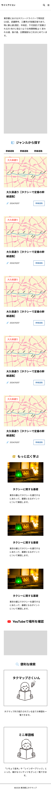

# 「東京都心タクマップ」関連ドキュメント

新人のタクシー運転手にとって役立つ地理知識を学習できるウェブアプリケーション「東京都心タクマップ」の仕様・設計・開発過程をまとめるリポジトリです。

既存のWordPressサイト「[東京都心タクマップ](https://tokyotaximap.com)」を、Next.jsを使用したウェブアプリケーションへリニューアルします。

## ドキュメント

### 要件

- [ユーザーと利用目的](./docs/requirements/users.md)
- [機能要件](./docs/requirements/features.md)
- [コンテンツ構造](./docs/requirements/content.md)

### 設計

- [UI・UX設計](./docs/design/ui-ux.md)
- [コンテンツモデル・編集方針](./docs/design/content-model.md)
- [アプリケーション技術設計](./docs/design/architecture.md)
- [インフラ設計](./docs/design/infrastructure.md)

### 移行・運用

- [WordPressからの移行](./docs/operations/migration.md)
- [コンテンツの編集・公開](./docs/operations/publishing.md)

### 意思決定記録

- [ADR 0001: Next.jsを使用する](./docs/decisions/0001-use-nextjs.md)

## 開発・検討ログ

- [`logs/ai/project.md`](./logs/ai/project.md): プロジェクトに関する検討ログ
- [`logs/ai/design.md`](./logs/ai/design.md): デザインに関する検討ログ
- [`logs/ai/images/`](./logs/ai/images/): 画面案などの画像

## 現在の主な未決定事項

- CMSの採否と製品選定
- 全文検索とサジェストの実現方式
- Markdown記事のメタデータ構造
- ピンの位置情報の管理方法
- ホスティング・デプロイ・監視
# 「東京都心タクマップ」関連ドキュメント

新人のタクシー運転手にとって役立つ地理知識を学習できるウェブアプリケーション「東京都心タクマップ」の開発の過程を記したドキュメントです。

## プロジェクトについて

### 主なターゲット

1. 40、50 代の男性(運転手側)

全くの異業種からタクシー業界に転職してきた。東京都心部の正確な地理知識はほぼ皆無で、運転については週末に少しすることがある程度。すこし老眼が始まっている。

2. 40 代のサラリーマン(乗客側)

要職に就き、仕事に邁進している。ビジネスアワーでよく得意先に行くためにタクシーを利用していて、東京の都心部の道路交通をある程度理解している。
 
このペルソナの設定は、乗客側にとっても閲覧価値のあるコンテンツ作成を目指すことを指し示している。実際の運行中に運転手が知識のない目的地について調べる必要が生じることがよくある。乗客も一緒になってウェブ上で調べ、どちらかがこのサイトを見つけて必要な情報(車寄せへの入口など)にアクセスできるようにする。乗客が見つけた場合は各ページに QR コード表示機能をつけることで、運転手と共有できるようにもしたい。

3. 40 代の外国人男性(運転手側)

外国から出稼ぎで日本にでてきて、すぐに収入が見込めるタクシードライバーの運転手になった。日本語は日常会話が多少できる程度。母語は英語なので、外国人相手の接客は得意としている。所属している会社の営業所に多少の面識のある人はいる。
 
将来的にはこのようなユーザーにも役立つ英語でのテキスト表示も目指すが、現在時点(2026/07/12)で考えているリニューアルではまだ考慮しない。

### 一番達成したいこと

- 運転手自身が知識を持たないが定番で言われる施設などについて、このアプリケーションを使用することで理解して運行できる。
- 乗務中の休憩時間や、明けの時間に気になったことについて参考の資料になる

### 既存サイトについて

- WordPress の既存テーマを使ったウェブサイト([東京都心タクマップ](https://tokyotaximap.com))があり、それを更新する予定である。
   
  WordPress の使用を終了し、Next.js を使用したものに変更する。サイトドメイン、記事 URL は同じものを引き継ぎ、利用者は今のブックマークや検索結果からたどり着けるようにする。

## コンテンツ・機能

### 検索機能 

運行中の第一導線は検索にする。検索ワードに関するコンテンツを一覧できるようにするため、本文全文を検索対象にする。運行時に初めてのビルを調べる場合は、検索を行わせることで目的の記事に素早く辿り着けるようにする。タクシーでは「過去に使われていた名称」や「正式名称が一般的には定義されておらず、ユーザーによって呼び方がまちまち」なものが多くある。キーワードとしてそれらの名称も登録しておくことで検索効率を上昇させる。
 
サジェスト機能を導入し、検索ボックスに文字を入力している間に「(自分が知りたいのは)これかも」と思わせられるようにする。この場合、候補をタップすると検索ボックスに候補のタイトルが挿入され、すぐに検索ボタンの押下につなげられるようにする。
固定ヘッダーの検索ボックスで検索ボタンを押したあとの記事一覧ページは、サジェストから候補を入れたあとも必ず挟む。これは「目的の記事に素早く辿り着ける」目的には貢献しない。しかしこのようなブログのようなコンテンツサイトとしては一般的な挙動であり、運行中のような時間がタイトなときでもストレスをかける要因にはならないと考えているからである。
 
モバイルでは、トップにはピンマップを配置し、固定ヘッダーに検索ボタン、ハンバーガーメニューを配置する。ハンバーガーメニューとは独立して検索ボタンを配置することで「すぐにここから検索できる」ことを指し示す。かつ固定ヘッダーに配置することで、ピンマップのように目立ちはしないが「どのページにいてもすぐ検索できる」効果を重要と考えている。
参考: 

検索マークを押下することでモーダルが出現し、画面の大きなスペースを検索ボックス、サジェストの表示に使用する。
インライン入力欄を使用しない理由として、ボックスやサジェストの文字の小ささに注意したい点が挙げられる。例えば首都高の交通情報サイトのリアルタイムルート検索(https://search.shutoko-eng.jp/search.html)では、出発地や到着地をインラインで入力し、サジェストを表示させることができる。しかしスマートフォンで閲覧するとその両方がどうしても狭く感じ、ストレスになると考えられる。
 
PC でも検索ボタンをヘッダーに常設する。しかし広くスペースがある PC ではピンマップの利用がより多いと考えられ、モバイルのように「第一導線:検索 第二導線:ピンマップ」という優先順位の意識はしない。一般的なアプリケーションの UI として検索はどこからでもできるようにし、ピンマップはトップページのみに配置する。

モーダルはどの画面からでも共通のものが開く。

### ピンマップ 

Next.js で外部ライブラリ(Leaflet)を使用して、サイト内のコンテンツを地図内で一覧できる。目的のピンを選択するとポップアップが出現し、概要文、Google マップへのリンク、当サイトの解説記事へのリンクが表示される。このときは記事リンクへ直行する。
参考: [タクシー運転手向けピンマップ(テスト)](https://sample-map-eight.vercel.app/)
 
コンテンツの内容としては、現在コンテンツとして存在するカテゴリの中から、「交差点」、「主要駅」、「施設」、「抜け道(定番ルートは指し示す範囲が広いので表示しない)」、「知名度の高い道」、「首都高(出入口)」を掲載する。
 
その他のコンテンツは、運行中の使用を想定しておらず、ピンとして表示する必要性が薄いためピンマップに表示しない。「読み物」としてのコンテンツである。
 
ピンマップは第二の導線とする。これは、検索は「仕事に出たばかりの新人」も想定ユーザーにいれているのに対して、こちらは「3 ヶ月程度は営業を経験したドライバー」またはそれ以降のドライバーを想定しているためである。ピンマップは、例えば

> 「◯◯ の首都高の入口から入りたいけど、あそこ方向によって右折禁止なかったっけ?」

と思ったドライバーがすぐ確認したいときに使う、というシチュエーションを想定している。休憩時の俯瞰用というわけではない(もちろんそのように使ってもらうのは構わない)が、第一導線としてはまっさらな新人に使いこなすのは難しいと思われる。
 
ピンマップは、トップページのファーストビューに常設する。PC と TB、 SP で変わるのはあくまでレイアウトのみであり、表示コンテンツは変わらない。

参考:

参考:

### 記事のボリューム感 

幹線道路のみで現在 32 本。全体で約 300 本のコンテンツがすでにある。リニューアルが完了後は、倍の 600 本ほどにする予定。

### YouTube の位置づけ 

自社チャンネルを運営する。現在の本数は 30 本ほど。幹線道路、施設の進入路、抜け道といったビジュアルでより覚えるのが効果的な記事に紐づいて動画を作成していく予定。
 
YouTube 動画なのでもちろん YouTube アプリで閲覧は可能だが、基本的に記事ページに埋め込みを行うことで画面の遷移のわずらわしさを軽減したい。 タイミングとしては運行中(正確には「停車中」を想定している。具体的には「無線連絡が入ってお迎え先が指定されたが、初めて行くビルなので調べたい」といったシチュエーション)にも閲覧しようと思える短時間で確認が可能なもの。

> ⚠️ **注意：** 「幹線道路」や「交差点」カテゴリの動画などはゆっくり流し見するのが想定されるため、このようなシチュエーションで視聴されることは想定していない。

### QR コード機能

運転手と乗客で同じサイト URL を共有するために、記事ごとに QR コードを表示することができる。例えば目的地についてわからない情報があるときに乗客が当サイトのページを見つけた際、運転手に QR コードを読み込ませることで運転手も同じページを閲覧して情報を取得できる。
このときのデバイスは、運転手、乗客ともにスマートフォンを想定している。各会社のタクシーの車載ナビは独自性があるため、当サイトではその利用を想定していない。

#### 実際のシチュエーション

1. 乗客が乗車する
2. 乗客が運転手に知名度のある行き先を伝えるが、運転手がわからない
3. 停車した状態で、お互いにスマートフォンで調べる
4. 乗客が当サイトのページを発見する。「QR コードで共有」ボタンを押し、運転手に見せる
5. 運転手がスマートフォンでカメラを起動し、読み取る。該当ページに移動し、情報を得る。

#### 共有について

この機能は、ページコンテンツ内に「このページを QR コードで共有する」というボタンを設置することで使用できるようにする。ただし位置は「重要ブロック」の下、本文の上という場所にする。理由としては良いアイデアではあるものの、「QR コードを用いて Web ページを共有する」というのは一般的ではなく、表示の優先度合いは低いと考えられるためである。また本文は長いテキストであるために運行中に読まれることはあまり想定されない。そのため

重要ブロック(運行中に読まれる)

共有ボタン(運行中に使用される)

本文(休憩時など時間のあるときのみ閲覧される)

という並びにする。

## デザイン・実装

### ブランドのトーン

イメージは教科書的。「緊張感のある実際の運行時の使用をみすえる」ため、オシャレ感よりもストレスレスな操作を可能にするデザインを追求する。現在はプライマリーカラーを目に優しく落ち着いた色である#95C7EC に設定しているが、「安全」「自然」を想起させる緑色にする案も思案中である。

### モバイル対応

モバイルファースト、レスポンシブデザインで設計する。基本的に車内で使用するユーザーを想定しているため。
参考として、既存サイトのデバイス別の使用率は、モバイル:64.9%、デスクトップ:33.8%、タブレット:1.4%(Google アナリティクスによる 2026/06/24 時点の一ヶ月単位での集計結果より)。

使用想定デバイスは、PC、タブレット(TB)、スマートフォン(SP)である。タブレットは使用率は少ないものの、ドライバーによっては個人で所有しているタブレットを運転席に配置している状況も街中で見ることがあるため想定する必要がある。

ブレイクポイントは、それぞれで特有である。

### サイドバーの挙動

初期状態はサブメニューが閉じている。スクロール時に固定。

### 実装予定の技術スタック

Next.js を使用。CMS をどうするか決定していきたい。

## ビジュアル

### ロゴ・サイトアイコンの方向性

未定。

### 記事サムネイルの方針

各記事ごとに「その記事の概要を 1 枚にまとめた画像」を用意しているので、それを使用する。

## UI・UX

### ユーザーが使うシチュエーション

基本的に、運行中に対象の情報に素早くユーザーがアクセスできることを目指す。ピンマップや検索結果ページ、記事ページ全体に同じ UX 原則を当てはめる。記事ページ内では「車寄せの情報」や「特定方向での右折禁止」といった運行中に知りたい可能性が高いもの、ビジュアルで確認できる YouTube を優先的に上部に配置させる。
カテゴリごとに優先的に表示する情報は違うことに留意する必要がある。例えば「施設」カテゴリでは「車寄せの情報」が重要であり、「交差点」や「首都高」では「右折禁止」の情報が重要である。コンテンツは Markdown で管理し、それぞれのカテゴリごとに重要なブロックを上部に配置することとする。

> これらの「そのページで強調すべき情報を表示したブロック」を「重要ブロック」と呼ぶことにする。

### 編集ルール

既存の wordpress サイトは自由に編集しながら作成してきたもののため、ルールが定まっていない。別ディレクトリで言語化して仕様にまとめていく予定である。ただし最終的には同じカテゴリの記事でもドライバーの現場目線ではそれぞれの記事ごとに重要な項目の順序は変わるため、あまり明確なルールは現時点では定めないものとする。既存の記事は、リニューアルしたアプリケーションの公開後に順次直していくこととする。これは WordPress の既存テーマで作成した現在のサイトでもすでにある程度のアクセス数があることから、「新しい技術でのデザイン、実装」→「リリース」→「リライト」という順序で問題ないという判断である。

> 開発者側の都合としては、デザインやエンジニアリングの初学者でありかつ 1 人で開発を進めているため、情報の配置変更までリニューアルの際に完了しているのは非現実であるという実感もある。

 
実践講座やさくいん、ミニ単語帳ページは教科書や辞書のようなイメージであり、休憩中などに閲覧することを想定している。
 
ただしミニ単語帳は、掲載している単語を検索で結果にあがってくるようにする。ミニ単語帳のワードがヒットした場合、ヒット先は「ミニ単語帳」ページの該当単語の箇所となる。

## 掲載情報の構造

当サイトのコンテンツの構造を説明する。以下のカテゴリに分けられる。

### 単語系記事

施設や道路を、それぞれごとに説明したページ。

- 幹線道路
- 交差点
- 主要駅
- 施設
- 知名度の高い道
- 抜け道、定番ルート
- 首都高

それぞれは所属の区(都心 5 区)があるわけなので、それも紐づけるようにする。
区の紐づけは、ユーザーが記事を絞りこむために行うのが第一の目的である。休憩の時間など余裕のあるときに、「◯◯ 区について勉強したい」という状況に対応することを想定している。記事ごとにタイトルの箇所が所在している区を設定し、トップページに「区から探す」というセクションを設けることで勉強を進められるようにする。区を選択後は、その区の全記事が一覧で表示される。区の全記事には、実践講座(※エリアに関係なくタクシーの運行に関わるコンテンツは除く)、ミニ単語帳も含んでいる。

> ※「タクシー基礎」カテゴリは基本的に区のカテゴリ指定をしない。「主要エリア解説」は地理的な区分けに従ってコンテンツを作成するので指定をする。「その他」はコンテンツ次第で流動する。

複数の区にまたがる線上のコンテンツ(「幹線道路」や「知名度の高い道」、「抜け道、定番ルート」)は、その線が通っている区を全て紐づける。これは、どうしても一覧のなかに記事数が増えてしまうことを意味するが、それよりも新人ドライバーの間違った「◯◯ 通りは △△ 区だよな」という思い込みを改善できる可能性を重要と考えているためである。
また開発者側としては、できるだけ区ごとの情報量を均一化したいという思いがあり、情報の整理に役立つと考えている。

### 実践講座

タクシーの運行にあたって、より実践的に活かせる情報を掲載する。

- タクシー基礎
- 主要エリア解説

エリアは千代田区の「大手町」や港区の「青山(北青山、南青山)」程度の粒度とする。区のなかをさらに区切った形であり、区カテゴリは 1 つに定まることになる。

- その他お役立ち知識

### その他のコンテンツ

上記に加え、以下のコンテンツがある。

- さくいん
   
  サイト内の全記事のタイトル(実践講座を含む)を一覧で閲覧することが可能。このページは運行時の使用は想定していない。「どんなコンテンツがあるのか見てみたい」というユーザーに対応するために設置する。

- ミニ単語帳
   
  1 ページを割いて説明する必要はないが、乗客とのコミュニケーションでよく使うもの(例:山手トンネル、レインボーブリッジ)を一覧で掲載する。これは全区共通の同一ページへのリンクである。
  参考: 
