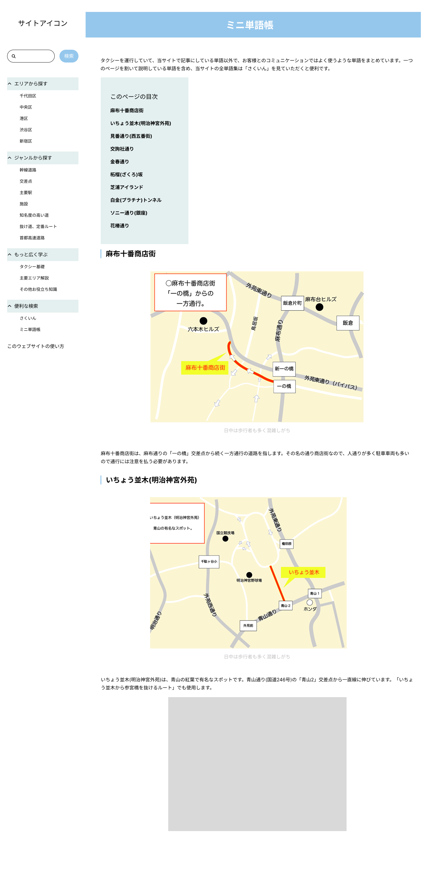

# コンテンツ構造

## 単語系記事

施設や道路を、それぞれ個別に説明する。

- 幹線道路
- 交差点
- 主要駅
- 施設
- 知名度の高い道
- 抜け道、定番ルート
- 首都高

### 区との紐づけ

記事には所属する都心5区を紐づける。第一の目的は、ユーザーが記事を区で絞り込めるようにすることである。休憩時間などに「特定の区について勉強したい」という状況を想定する。

記事ごとに、タイトルが示す場所の所在区を設定する。トップページに「区から探す」セクションを設け、区の選択後はその区の全記事を一覧表示する。

区の全記事には、区に紐づく実践講座と、全区共通のミニ単語帳へのリンクも含める。ただし、エリアに関係なくタクシーの運行全般に関わるコンテンツは除外する。

- 「タクシー基礎」は基本的に区を指定しない。
- 「主要エリア解説」は地理的な区分に従い、区を指定する。
- 「その他お役立ち知識」はコンテンツに応じて判断する。

複数区にまたがる線状コンテンツ（幹線道路、知名度の高い道、抜け道・定番ルート）は、その線が通る区をすべて紐づける。一覧の記事数は増えるが、新人ドライバーの「この通りはこの区だけ」という誤った思い込みを改善できる可能性を優先する。

開発者側では、区ごとの情報量をできるだけ均一化するための整理にも活用する。

## 実践講座

タクシーの運行にあたり、より実践的に活かせる情報を掲載する。

### タクシー基礎

基本的に区は指定しない。

### 主要エリア解説

千代田区の「大手町」や港区の「青山（北青山、南青山）」程度の粒度とする。区の中をさらに区切るため、所属する区は1つに定まる。

### その他お役立ち知識

区との紐づけはコンテンツに応じて判断する。

## その他のコンテンツ

### さくいん

実践講座を含む、サイト内の全記事タイトルを一覧表示する。運行時の使用は想定せず、「どんなコンテンツがあるか見たい」という利用者に向けて設置する。

### ミニ単語帳

1ページを割いて説明する必要はないが、乗客とのコミュニケーションでよく使うもの（例: 山手トンネル、レインボーブリッジ）を一覧掲載する。全区共通の同一ページとする。

掲載語は検索対象にし、検索結果からミニ単語帳ページの該当箇所へ移動できるようにする。

参考: 
