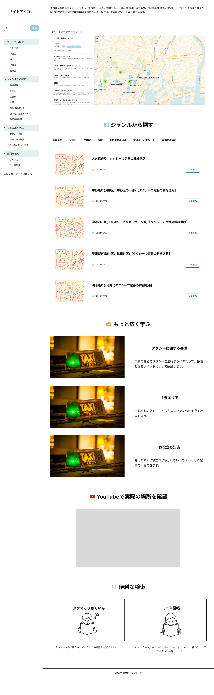

# デザイン全体の AI レビュー

##　日時:2026-06-19 14:30 JST

```https://www.figma.com/design/JWqP9VJGxQyNK2lFnYAnLb/%E6%9D%B1%E4%BA%AC%E9%83%BD%E5%BF%83%E3%82%BF%E3%82%AF%E3%83%9E%E3%83%83%E3%83%97?node-id=33-3&m=dev
ﾊｧｰｲCursor。このデザインをみてフィードバックをください。サムネイルなどはまだ個別の画像を設定していません。そもそもプロジェクトのコンセプトなど、欲しい情報があればそれも教えてください。
```

## 添付素材



## 回答

[Figma のデザイン](https://www.figma.com/design/JWqP9VJGxQyNK2lFnYAnLb/%E6%9D%B1%E4%BA%AC%E9%83%BD%E5%BF%83%E3%82%BF%E3%82%AF%E3%83%9E%E3%83%83%E3%83%97?node-id=33-3&m=dev)（PC トップページ）を確認しました。サムネイル未設定は前提として、全体の印象と改善ポイントをまとめます。

---

## 全体印象

**「都心タクシードライバー向けの地理情報ポータル」**として、情報の切り口がよく整理されています。左サイドバーで探し、メインで深掘りする 2 カラム構成は、辞書・マニュアル系サイトに合っています。

特に良い点：

- **IA（情報設計）が明快** — 「エリア」「ジャンル」「学ぶ」「便利な検索」の 4 軸が、タクシー業務の思考順序（どこで → 何を → なぜ）に沿っている
- **ピンマップをファーストビュー付近に置いている** — 「地図で探す」というこのサイトの核が冒頭で伝わる
- **記事カードの構造が実用的** — タイトル・更新日・カテゴリタグが揃っており、一覧性が高い
- **色のトーンが落ち着いている** — 白ベース＋ライトブルー（`#95C7EC`）＋ダークブルー（`#004B97`）で、長時間読んでも疲れにくい

---

## デザイン面のフィードバック

### 1. フォントの不整合

スタイル名は `Ja/NotoSansJP` ですが、実際のフォントは **Inter** になっています。日本語本文サイトでは Noto Sans JP の方が読みやすく、意図したトーンにも合います。実装前にフォントを統一することをおすすめします。

### 2. サイドバーとメインの役割分担

現状、サイドバー（ナビ展開時）とメイン（タブ＋記事一覧）で **同じカテゴリが二重に見える** 構成です。意図的なら問題ありませんが、ユーザーには「どちらが主導線か」が伝わりにくい可能性があります。

検討案：

- サイドバーは **常にコンパクト**（折りたたみ or アイコンのみ）にして、メインを主導線にする
- またはサイドバーを **スティッキー** にして、長いページでも常にナビが使えるようにする

### 3. タブメニューのアクティブ状態

7 つのタブ（幹線道路・交差点・主要駅…）がありますが、**選択中タブの視覚的フィードバック**（下線・背景色・太字の差など）が弱いです。現状は「幹線道路」が太字程度に見えます。ホバー・アクティブ・非アクティブの 3 状態を定義しておくと実装がスムーズです。

### 4. 検索バーのバランス

サイドバー内の検索バーで、**入力欄が狭くボタンが大きい**印象です（入力約 27%、「検索」ボタン約 73%）。キーワード検索が主機能なら、入力欄を広げた方が使いやすいです。

### 5. 記事カード内の余白

タイトルと日付・カテゴリの間に **36px のギャップ** があり、やや間延びして見えます。20〜24px 程度に詰めると、一覧の情報密度が上がります。

### 6. ページの長さと導線

縦約 4,600px と長いページです。セクション間の `gap: 100px` はゆったりしていますが、**「このサイトの使い方」への導線**がサイドバー最下部のみです。初見ユーザー向けに、概要文の直下かピンマップ付近に短い案内を置くと親切です。

### 7. ピンマップの説明不足

マップは目立つ位置にありますが、**「何ができるのか」**（クリックで記事へ、エリア絞り込み、など）の説明がありません。1 行のキャプションや凡例があると、初見でも迷いません。

### 8. 「もっと広く学ぶ」カードの差別化

3 枚とも同じプレースホルダー画像（タクシー看板）のため、カテゴリの違いが視覚的に伝わりにくいです。サムネイル設定時は、**基礎／エリア／お役立ち**でトーンや被写体を変えると効果的です。

### 9. YouTube セクション

グレーのプレースホルダー（700×394）のみで、**何を埋め込むか**が不明です。チャンネル紹介・プレイリスト・個別動画のどれかで、レイアウトが変わります。複数動画ならカルーセルやグリッドも検討の余地があります。

### 10. レスポンシブ未確認

PC（1440px）のみのようです。タクシードライバーは **スマホで確認する場面**も多いはずなので、モバイル版（サイドバー → ハンバーガー、タブ → 横スクロール or ドロップダウン）の検討を早めに入れるとよいです。

### 11. 細かい点

- フッターが `©2026`、記事の日付が `2024/10/07` — 意図的なら問題なし
- 概要文で「特に都心部（港区、中央区、千代田区）」とある一方、エリアナビは 5 区（新宿・渋谷含む）— **対象エリアの範囲**を文案とナビで揃えるとよいです
- カテゴリタグのボーダー色（`#004B97`）はアクセントとして効いていますが、**ホバー時の変化**（塗りつぶし等）があるとクリック可能だと伝わります

---

## 情報設計・UX の観点

| セクション       | 評価 | コメント                               |
| ---------------- | ---- | -------------------------------------- |
| 概要文           | ◎    | 誰向けかが明確                         |
| ピンマップ       | ○    | 核コンテンツだが操作説明が欲しい       |
| ジャンルから探す | ◎    | タブ＋カードで実用的                   |
| もっと広く学ぶ   | ○    | 構造は良い、画像差別化で向上           |
| YouTube          | △    | 目的・コンテンツ方針の確定が先         |
| 便利な検索       | ◎    | さくいん・単語帳は辞書サイトとして強い |

---

## 追加で教えてほしいこと

より踏み込んだフィードバック（下層ページ、実装方針、コンテンツ戦略）のために、以下を教えていただけると助かります。

### プロジェクトの根幹

1. **主なターゲット** — ベテラン向けの抜け道辞典？ 新人・二種免許取得者向けの学習サイト？ その両方？
2. **一番達成したいこと** — 例：「この道を覚えた」「現場で迷わず走れた」「二種の地理試験に役立った」
3. **既存サイトの有無** — リニューアルか、新規立ち上げか

### コンテンツ・機能

4. **ピンマップの挙動** — 静的画像？ クリックで記事へ？ 外部マップ（Google Maps 等）連携？
5. **検索の範囲** — タイトルのみ？ 本文全文？ エリア・ジャンル絞り込み？
6. **記事のボリューム感** — 幹線道路だけで何本くらい？ 全体で数百？ 数千？
7. **YouTube の位置づけ** — 自社チャンネル？ キュレーション？ 各記事に紐づく動画？

### デザイン・実装

8. **ブランドのトーン** — 公的・教科書的 / 親しみやすい・現場感 / プロフェッショナル
9. **モバイル対応の優先度** — PC ファーストでよいか、スマホ同等に重要か
10. **サイドバーの挙動** — スクロール時に固定？ 折りたたみ可能？
11. **実装予定の技術スタック** — 静的サイト、CMS、Next.js など

### ビジュアル

12. **ロゴ・サイトアイコンの方向性** — 地図モチーフ、タクシー、文字ロゴなど
13. **記事サムネイルの方針** — 地図スクリーンショット、現地写真、イラストのどれが主か

---

## まとめ

骨格はしっかりしていて、**「都心タクシー向け地理情報サイト」としての IA は十分に機能する**デザインです。次のステップとして優先度が高いのは：

1. **フォント統一**（Noto Sans JP）
2. **タブ・ナビのインタラクション状態**の定義
3. **ピンマップの操作説明**の追加
4. **モバイル版**のワイヤー
5. **サムネイル・YouTube**のコンテンツ方針確定

上記の質問に答えていただければ、セクション単位でもっと具体的な改善案（コピー、レイアウト、コンポーネント設計）まで落とし込めます。
