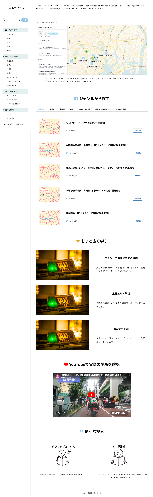

# デザイン全体の AI レビュー

以下のフォーマットを使用する。

```

## 日時:2026-06-19 14:30 JST(例)

(コードブロック)
質問
(コードブロック)

## 添付素材

## 回答

---(区切り線)
```

##　日時:2026-06-19 14:30 JST

```
質問
https://www.figma.com/design/JWqP9VJGxQyNK2lFnYAnLb/%E6%9D%B1%E4%BA%AC%E9%83%BD%E5%BF%83%E3%82%BF%E3%82%AF%E3%83%9E%E3%83%83%E3%83%97?node-id=33-3&m=dev
ﾊｧｰｲCursor。このデザインをみてフィードバックをください。サムネイルなどはまだ個別の画像を設定していません。そもそもプロジェクトのコンセプトなど、欲しい情報があればそれも教えてください。
```

## 添付素材


## 回答

[Figma のデザイン](https://www.figma.com/design/JWqP9VJGxQyNK2lFnYAnLb/%E6%9D%B1%E4%BA%AC%E9%83%BD%E5%BF%83%E3%82%BF%E3%82%AF%E3%83%9E%E3%83%83%E3%83%97?node-id=33-3&m=dev)（PC トップページ）を確認しました。サムネイル未設定は前提として、全体の印象と改善ポイントをまとめます。

---

## 全体印象

**「都心タクシードライバー向けの地理情報ポータル」**として、情報の切り口がよく整理されています。左サイドバーで探し、メインで深掘りする 2 カラム構成は、辞書・マニュアル系サイトに合っています。

特に良い点：

- **IA（情報設計）が明快** — 「エリア」「ジャンル」「学ぶ」「便利な検索」の 4 軸が、タクシー業務の思考順序（どこで → 何を → なぜ）に沿っている
- **ピンマップをファーストビュー付近に置いている** — 「地図で探す」というこのサイトの核が冒頭で伝わる
- **記事カードの構造が実用的** — タイトル・更新日・カテゴリタグが揃っており、一覧性が高い
- **色のトーンが落ち着いている** — 白ベース＋ライトブルー（`#95C7EC`）＋ダークブルー（`#004B97`）で、長時間読んでも疲れにくい

---

## デザイン面のフィードバック

### 1. フォントの不整合

スタイル名は `Ja/NotoSansJP` ですが、実際のフォントは **Inter** になっています。日本語本文サイトでは Noto Sans JP の方が読みやすく、意図したトーンにも合います。実装前にフォントを統一することをおすすめします。

### 2. サイドバーとメインの役割分担

現状、サイドバー（ナビ展開時）とメイン（タブ＋記事一覧）で **同じカテゴリが二重に見える** 構成です。意図的なら問題ありませんが、ユーザーには「どちらが主導線か」が伝わりにくい可能性があります。

検討案：

- サイドバーは **常にコンパクト**（折りたたみ or アイコンのみ）にして、メインを主導線にする
- またはサイドバーを **スティッキー** にして、長いページでも常にナビが使えるようにする

### 3. タブメニューのアクティブ状態

7 つのタブ（幹線道路・交差点・主要駅…）がありますが、**選択中タブの視覚的フィードバック**（下線・背景色・太字の差など）が弱いです。現状は「幹線道路」が太字程度に見えます。ホバー・アクティブ・非アクティブの 3 状態を定義しておくと実装がスムーズです。

### 4. 検索バーのバランス

サイドバー内の検索バーで、**入力欄が狭くボタンが大きい**印象です（入力約 27%、「検索」ボタン約 73%）。キーワード検索が主機能なら、入力欄を広げた方が使いやすいです。

### 5. 記事カード内の余白

タイトルと日付・カテゴリの間に **36px のギャップ** があり、やや間延びして見えます。20〜24px 程度に詰めると、一覧の情報密度が上がります。

### 6. ページの長さと導線

縦約 4,600px と長いページです。セクション間の `gap: 100px` はゆったりしていますが、**「このサイトの使い方」への導線**がサイドバー最下部のみです。初見ユーザー向けに、概要文の直下かピンマップ付近に短い案内を置くと親切です。

### 7. ピンマップの説明不足

マップは目立つ位置にありますが、**「何ができるのか」**（クリックで記事へ、エリア絞り込み、など）の説明がありません。1 行のキャプションや凡例があると、初見でも迷いません。

### 8. 「もっと広く学ぶ」カードの差別化

3 枚とも同じプレースホルダー画像（タクシー看板）のため、カテゴリの違いが視覚的に伝わりにくいです。サムネイル設定時は、**基礎／エリア／お役立ち**でトーンや被写体を変えると効果的です。

### 9. YouTube セクション

グレーのプレースホルダー（700×394）のみで、**何を埋め込むか**が不明です。チャンネル紹介・プレイリスト・個別動画のどれかで、レイアウトが変わります。複数動画ならカルーセルやグリッドも検討の余地があります。

### 10. レスポンシブ未確認

PC（1440px）のみのようです。タクシードライバーは **スマホで確認する場面**も多いはずなので、モバイル版（サイドバー → ハンバーガー、タブ → 横スクロール or ドロップダウン）の検討を早めに入れるとよいです。

### 11. 細かい点

- フッターが `©2026`、記事の日付が `2024/10/07` — 意図的なら問題なし
- 概要文で「特に都心部（港区、中央区、千代田区）」とある一方、エリアナビは 5 区（新宿・渋谷含む）— **対象エリアの範囲**を文案とナビで揃えるとよいです
- カテゴリタグのボーダー色（`#004B97`）はアクセントとして効いていますが、**ホバー時の変化**（塗りつぶし等）があるとクリック可能だと伝わります

---

## 情報設計・UX の観点

| セクション       | 評価 | コメント                               |
| ---------------- | ---- | -------------------------------------- |
| 概要文           | ◎    | 誰向けかが明確                         |
| ピンマップ       | ○    | 核コンテンツだが操作説明が欲しい       |
| ジャンルから探す | ◎    | タブ＋カードで実用的                   |
| もっと広く学ぶ   | ○    | 構造は良い、画像差別化で向上           |
| YouTube          | △    | 目的・コンテンツ方針の確定が先         |
| 便利な検索       | ◎    | さくいん・単語帳は辞書サイトとして強い |

---

## 追加で教えてほしいこと

より踏み込んだフィードバック（下層ページ、実装方針、コンテンツ戦略）のために、以下を教えていただけると助かります。

### プロジェクトの根幹

1. **主なターゲット** — ベテラン向けの抜け道辞典？ 新人・二種免許取得者向けの学習サイト？ その両方？
2. **一番達成したいこと** — 例：「この道を覚えた」「現場で迷わず走れた」「二種の地理試験に役立った」
3. **既存サイトの有無** — リニューアルか、新規立ち上げか

### コンテンツ・機能

4. **ピンマップの挙動** — 静的画像？ クリックで記事へ？ 外部マップ（Google Maps 等）連携？
5. **検索の範囲** — タイトルのみ？ 本文全文？ エリア・ジャンル絞り込み？
6. **記事のボリューム感** — 幹線道路だけで何本くらい？ 全体で数百？ 数千？
7. **YouTube の位置づけ** — 自社チャンネル？ キュレーション？ 各記事に紐づく動画？

### デザイン・実装

8. **ブランドのトーン** — 公的・教科書的 / 親しみやすい・現場感 / プロフェッショナル
9. **モバイル対応の優先度** — PC ファーストでよいか、スマホ同等に重要か
10. **サイドバーの挙動** — スクロール時に固定？ 折りたたみ可能？
11. **実装予定の技術スタック** — 静的サイト、CMS、Next.js など

### ビジュアル

12. **ロゴ・サイトアイコンの方向性** — 地図モチーフ、タクシー、文字ロゴなど
13. **記事サムネイルの方針** — 地図スクリーンショット、現地写真、イラストのどれが主か

---

## まとめ

骨格はしっかりしていて、**「都心タクシー向け地理情報サイト」としての IA は十分に機能する**デザインです。次のステップとして優先度が高いのは：

1. **フォント統一**（Noto Sans JP）
2. **タブ・ナビのインタラクション状態**の定義
3. **ピンマップの操作説明**の追加
4. **モバイル版**のワイヤー
5. **サムネイル・YouTube**のコンテンツ方針確定

上記の質問に答えていただければ、セクション単位でもっと具体的な改善案（コピー、レイアウト、コンポーネント設計）まで落とし込めます。

##　日時:2026-06-19 17:30 JST

```
質問
デザイン全体の概要を把握してレビューをしてください。
```

## 添付素材

数が多いので images/all/20260619 を参照

## 回答

このデザインは何か
「東京都心タクマップ」 — タクシードライバー向けの地理情報サイトです。概要文から、特別区（23 区＋武蔵野・三鷹）で営業するドライバー、とくに都心 3 区（港・中央・千代田）向けに、道・抜け道・主要施設などをまとめる、というコンセプトが読み取れます。

辞書・マニュアル型の情報サイトとして、IA は一貫しています。

ファイル構成
1 ページ内に、デザインの各レイヤーが整理されています。

セクション 役割
PC、TB デザイン
画面モック（PC 15 枚）
SP デザイン
画面モック（SP 15 枚＋テンプレート）
コンポーネント/バリアント (PC,TB)
UI パーツ（81 個）
【SP】コンポーネント/バリアント
SP 用パーツ（21 個）
カラー / タイポグラフィ
デザイントークン
PC-テンプレート
記事レイアウトの参照
メモ
レイアウト寸法の注記
デザインシステムと画面を同じファイルで管理している構成は、実装フェーズに入りやすいです。

サイトマップ（PC / SP 対応）
共通（3）

トップページ
カテゴリ一覧ページ
検索結果一覧ページ
ジャンル別（7） — 幹線道路、交差点、主要駅、施設、知名度の高い道、定番ルート・抜け道、首都高速道路

学習系（3） — タクシー基礎、主要エリア解説、お役立ち知識

便利な検索（2） — さくいん、ミニ単語帳

PC・SP で 同じ 15 画面が揃っている点は評価できます。

全体印象
強み

1. 情報設計が明快

左ナビの 4 軸が、ユーザーの思考順序と合っています。

エリアから探す → どこ？
ジャンルから探す → 何？
もっと広く学ぶ → なぜ・どう使う？
便利な検索 → 横断的に探す 2. レイアウトのルールが明確

メモに記載の通り、PC は次のグリッドです。

ヘッダー（サイドバー）: 288px（実コンテンツ 240px）
メイン: 1152px（実コンテンツ 1052px、左右 50px パディング）
実装時に迷いにくい設計です。

3. コンポーネント設計が進んでいる

ナビ（デフォルト / ホバー / 展開時）、記事カード、学びカード、ページネーション、リンクカードなど、バリアント付きで整理されています。記事カードにはジャンル別カテゴリタグ（7 種）もあり、一覧での識別性が高いです。

4. 記事ページのパーツが豊富

PC-タクシー基礎 などを見ると、長文記事に必要な要素が揃っています。

パンくず、執筆日
目次（h2 アンカー）
h2 / h3、テキストブロック
画像、枠線ボックス、情報テーブル
リンクカード、Google マップ
前後ページネーション
地理情報サイトとして必要な表現力は十分あります。

5. カラーパレットが落ち着いている

白ベース＋ライトブルー系で、長時間読んでも疲れにくいトーンです。

トークン 色 用途
base-color
#FFFFFF
背景
text-color
#1C1C1C
本文
primary-color
#95C7EC
ボタン・見出し帯
background-color
#E4EFEF
ナビ展開時
localroad-color
#004B97
カテゴリタグ
link-color
#00BBDD
リンク
secondary-color
#7DC2BB
補助色
気になる点・改善提案

1. TB（タブレット）が未定義
   セクション名は「PC、TB デザイン」ですが、TB 専用フレームは見当たりません。768px 前後でサイドバーをどうするか（折りたたみ、オーバーレイなど）を早めに決めておくと、実装時の手戻りを減らせます。

2. フォントの不整合
   タイポグラフィ仕様では Noto Sans JP（ベース 16px、行間 1.7）ですが、登録済みテキストスタイルの多くは Inter です。32px のみ Noto Sans JP になっています。画面上の本文もほぼ Inter です。

日本語の長文サイトでは、Noto Sans JP への統一を推奨します。

3. サイドバーが常に「全展開」
   全ページで ヘッダー(フルオープン時) が使われており、折りたたみ時・スクロール固定時 のデザインがありません。記事ページではサイドバーが長く、メインの読了に対してナビが常に占有されます。スティッキー表示や折りたたみ状態の検討余地があります。

4. タブメニューの「選択中」状態がない
   PC の タブメニュー はデフォルト / ホバーのみ。SP の 【SP】タブメニュー は単一コンポーネントで、ホバー・アクティブのバリアントがありません。7 つのジャンルタブがあるトップでは、「今どれを見ているか」が視覚的に伝わりにくいです。

5. SP のナビ展開が未設計
   SP ヘッダーはサイトアイコン＋検索＋ハンバーガーですが、メニューを開いたときのドロワー / オーバーレイ の画面が見当たりません。全ページにハンバーガーアイコンはあるものの、展開後の UI が空白です。

6. SP-テンプレートが未完成
   SP-テンプレート フレームにはヘッダーのみで、記事本文の SP レイアウトが未反映です。PC-タクシー基礎 にある目次・h2・リンクカードなどの SP 版をテンプレートに落とし込む必要があります。

7. ページの種類が 2 パターンある（意図の確認）
   記事ページには少なくとも 2 種類あります。

パターン 例 構成
A: 道路・施設系
PC-幹線道路
タイトル → 画像 → テキスト → 情報テーブル → 前後ナビ
B: 学習・解説系
PC-タクシー基礎
タイトル → 目次 → h2 見出し群 → リンクカード多数
意図的な使い分けなら問題ありませんが、どのジャンルがどちらのテンプレートかをドキュメント化しておくと、コンテンツ追加時に迷いません。

8. トップページの情報量
   PC SP
   高さ
   約 4,650px
   約 6,180px
   セクション間の余白（100px）は読みやすい反面、スクロール量が大きいです。SP では特に、「ジャンルから探す」へのジャンプリンクや、セクション折りたたみなどの検討余地があります。

9. コンテンツ上の小さな矛盾
   概要文: 「都心部（港区、中央区、千代田区）」
   エリアナビ: 5 区（上記 3 区＋渋谷・新宿）
   対象エリアの範囲を、文案とナビで揃えるとよいです。

10. プレースホルダーが多い
    サムネイル、ピンマップ、YouTube エリア、サイトアイコンが未設定です。構造としては問題ありませんが、サムネイルの方針（地図スクショ / 現地写真 / イラスト）を決めると、一覧の見え方が大きく変わります。

11. リンク色と primary 色の関係
    link-color（#00BBDD）は primary 系（#95C7EC）と色相・彩度が異なります。リンク・ボタン・アクセントの役割分担を整理すると、統一感が出ます。

ページ種別ごとの評価
ページ 評価 コメント
トップ
○
IA は良い。タブ状態・ピンマップ説明を追加するとよい
カテゴリ一覧
◎
見出し帯＋記事 10 件＋ページネーションで実用的
検索結果
○
「"渋谷"の検索結果」形式。0 件時・絞り込みは未定義
記事詳細（道路系）
○
テーブル付きで道路情報に適している
記事詳細（学習系）
◎
目次・リンクカードで回遊性が高い
さくいん / 単語帳
○
辞書サイトとして独自性がある
SP 全体
△
画面はあるが、ナビ展開・記事テンプレが不足
TB
×
未着手
まとめ
「都心タクシードライバー向け地理情報ポータル」として、骨格はしっかりしています。 PC の画面・コンポーネント・デザイントークンは実装に入れるレベルまで揃っています。

優先して手を入れるとよいのは次の 5 点です。

フォント統一（Noto Sans JP）
SP ナビ展開（ドロワー）のデザイン
タブのアクティブ状態の定義
SP 記事テンプレートの完成
TB ブレイクポイントの方針決定
より踏み込んだレビュー（特定ページの詳細、実装向けのコンポーネント整理、コンテンツ戦略との整合）をするには、次の情報があると助かります。

主なターゲット（ベテラン / 新人 / 二種取得者）
ピンマップの挙動（静的 / クリックで記事へ / 外部マップ連携）
記事の想定ボリューム（全体で数十 / 数百 / 数千）
実装予定の技術スタック
必要なら、特定セクションやページに絞った深掘りもできます。

---

## 日時:2026-06-23 17:30 JST

```
質問
最初のチャットでのアドバイスについてです。

4. 検索バーのバランス
サイドバー内の検索バーで、入力欄が狭くボタンが大きい印象です（入力約27%、「検索」ボタン約73%）。キーワード検索が主機能なら、入力欄を広げた方が使いやすいです。

とのことですが、その比率は何を表していますか。入力欄が164px、検索ボタンが64pxなのでよくわかりません。
```

## 添付素材


## 回答

その指摘は **比率の読み違い** です。  
あなたの認識どおり、**入力欄 164px、検索ボタン 64px** なら、「入力欄が 27%」ではありません。

正しくはおおむねこうです。

- 合計: `164 + 64 = 228px`
- 入力欄: `164 / 228 ≒ 72%`
- 検索ボタン: `64 / 228 ≒ 28%`

つまり、**入力欄が約 72%、検索ボタンが約 28%** です。

## どうしてそういう誤解が起きたか

前のレビューでは、Figma の出力を読む中で `73.33%` という値があり、これはたぶん **「ボタンが右側 64px 分を占めている位置指定」** を割合表現したものとして誤って読んでしまったのだと思います。  
実寸ベースで見るなら、あなたの言う `164px : 64px` が正しいです。

## ではデザインとしてはどうか

この比率なら、少なくとも

- 入力欄が極端に狭い
- ボタンが入力欄より大きい

という状態ではありません。なので、前回のその指摘は **撤回寄り** です。

ただし、別観点ではまだ見てもよい点があります。

- 検索語が長めに入る想定か
- プレースホルダー文を入れるか
- サイドバー全幅 `240px` の中で十分に押しやすいか
- 検索が主導線なのか補助導線なのか

もし検索が主導線ではなく補助機能なら、今の `164px + 64px` でもかなり自然です。

要するに、この件は **比率の説明ミス** で、あなたの理解の方が正しいです。必要なら、最初のレビューの中で「修正した方がよい点 / そのままでよい点」を切り分けて整理し直します。

---

## 日時:2026-06-23 18:00 JST(例)

```
質問
5. 記事カード内の余白
タイトルと日付・カテゴリの間に 36px のギャップ があり、やや間延びして見えます。20〜24px 程度に詰めると、一覧の情報密度が上がります。

という指摘についてです。わたしには間延びしているようには見えません。gapを詰めると窮屈に感じます。またもし2行にわたるタイトルが入った場合でも見やすくなるかなと思っています。
```

## 添付素材


## 回答

その感覚はかなりもっともです。ここは **正誤というよりデザイン方針の違い** で、あなたの判断に十分理由があります。

前回の指摘は、あくまで

- 一覧でより多くの情報を見せたい
- 1 画面あたりの件数密度を少し上げたい

という方向から見た意見でした。  
でも今回のカードは、**辞書的な一覧**というより、ある程度「1 件ずつ落ち着いて読ませる」性格もあります。そうなら `36px` はむしろ自然です。

## あなたの考えが妥当な理由

特にこの 2 点は強いです。

### 1. 2 行タイトルに耐えやすい

タイトルが長くなったときに、タイトルと日付・カテゴリが近すぎると、下の情報が食い込んで見えます。  
`36px` くらいあると、タイトルブロックとメタ情報ブロックが**視覚的にきれいに分離**されます。

### 2. 窮屈さを避けられる

記事カードは

- サムネイル
- タイトル
- 日付
- カテゴリ

と要素数は少ないので、情報密度を上げすぎると、確かに「一覧」というより「詰め込み」に見えやすいです。  
とくにこのサイトのトーンは、ニュースサイトのような高密度一覧より、**ややゆったり・学習寄り** の方が合っています。

## つまり、こう整理できます

前回の指摘は

> 密度を上げるなら 20〜24px もあり得る

という話であって、

> 36px は不適切

という意味ではありません。

むしろ今回の文脈では、

- 学習系・読み物系のトーン
- タイトルが長くなる可能性
- 窮屈さを避けたい

を考えると、**36px を維持する判断はかなり筋が通っています。**

## 判断基準としてはこれで十分です

もし迷うなら、見るべきは数値そのものより次の 3 点です。

- **1 行タイトルでもスカスカに見えないか**
- **2 行タイトルでも下の情報とぶつからないか**
- **カードを 5 件並べたときに全体のリズムがきれいか**

あなたが「間延びして見えない」「詰めると窮屈」と感じるなら、そのカード設計では **36px が適正値** なんだと思います。

要するに、この指摘は撤回してよいです。  
少なくとも私は今のあなたの説明を聞いて、**その余白は意図として成立している** と考えます。

---

## 日時:2026-06-24 0:30 JST(例)

```
質問
6. ページの長さと導線
縦約 4,600px と長いページです。セクション間の gap: 100px はゆったりしていますが、「このサイトの使い方」への導線がサイドバー最下部のみです。初見ユーザー向けに、概要文の直下かピンマップ付近に短い案内を置くと親切です。

という指摘についてです。サイドバーについては固定をしようと思っています。それなら導線が確保されると思いますがどうでしょう。
```

## 添付素材


## 回答

その考え方で **かなり筋が通っています**。サイドバーを固定するなら、前回の指摘のかなりの部分は解消できます。

## 固定サイドバーで改善されること

- ページを長くスクロールしても、**ナビ全体が常にそこにある**
- 「このサイトの使い方」が最下部にあっても、**メインを戻らずに辿れる**
- 検索バーも常に使えるので、**補助導線としてかなり強い**

辞書・マニュアル型サイトでは、**左ナビを固定するのは自然な選択**です。トップが 4,600px くらいあっても、「迷ったら左を見る」という使い方に合います。

## ただし、完全に同じ意味ではない

固定サイドバーは **「常にナビにアクセスできる」** ことの解決であって、**「初見ユーザーが使い方に気づく」** ことそのものの解決ではありません。

気にするとよいのはこの 2 点です。

### 1. サイドバー内でも下の方にある

ナビが全部展開された状態だと、サイドバー自体が縦に長いです。  
固定 + 内部スクロールにすると、「使い方」は **サイドバーを少し下までスクロールしないと見えない** ことがあります。

### 2. 初見ユーザーはまず本文を見る

固定ナビがあっても、最初は

1. 概要文
2. ピンマップ
3. ジャンルから探す

を読む人も多いです。サイドバー最下部の「使い方」に気づかない、というケースはゼロにはなりません。

## 結論

**固定サイドバーにするなら、概要文直下への案内は必須ではない** と思います。  
前回の指摘は、ナビが固定されていない前提に近かったので、あなたの方針なら優先度は下がります。

むしろ今の設計方針としては、こう整理するのがよさそうです。

| 施策                            | 優先度                             |
| ------------------------------- | ---------------------------------- |
| サイドバーを固定する            | 高い（やるならこれが本丸）         |
| セクション間 gap 100px を詰める | 低い（ゆったりでよいならそのまま） |
| 概要文直下に「使い方」案内      | 任意（なくても成立）               |

## 固定サイドバーにするなら、一緒に決めておくとよいこと

- サイドバーが画面より長いときは **内部スクロール** にするか
- ナビは **常に全展開** か、**折りたたみ** か
- 「このサイトの使い方」を **ナビの一番下のまま** でよいか、少し上に上げるか

固定するなら、「使い方」をナビ内で少し目立たせる（区切り線、別グループなど）程度で十分かもしれません。

**まとめると:** 固定サイドバーなら導線はかなり確保される、という理解で問題ありません。初見向けの本文内案内は「あれば親切」レベルで、必須ではないと思います。

---

## 日時:2026-06-19 14:30 JST(例)

```
質問
ふむ。
ナビゲーションは最初は折りたたみです。これはFigmaの画面で共有するときのために全展開の画像になっていますが、ユーザーが見出しをクリックしない限りサブメニューは開きません。
また「このサイトの使い方」についてですが、そもそもあまり閲覧されると思っていません。昨今のゲームソフトなどもそうですが、「説明書がなくても使い方が自然にわかる」ものを目指さないとユーザーが離れると思っています。なのでほかのコンテンツのメニューより優先度を下げています。
```

## 添付素材


## 回答

その方針、かなり一貫していて筋が通っています。前回の指摘は、**Figma 上の全展開状態**と**実際の初期状態**を混同した前提に近かったので、あなたの説明を聞くと優先度はかなり下がります。

## 折りたたみナビについて

実装が「最初は閉じている」なら、固定サイドバーの意味はさらにはっきりします。

- 普段は **見出し 4 つ＋使い方** くらいのコンパクトなナビ
- 必要なときだけサブメニューを開く
- 長いトップページを読みながらも、左の操作対象は小さく保てる

Figma を共有用に全展開で見せるのはよくあるやり方です。レビュー用には分かりやすい一方、**「初期状態がこう見える」前提でフィードバックされる**ことがあるので、メモやキャプションで

> 実装時は折りたたみ。全展開は構造確認用

と書いておくと、今回のようなズレは減ります。

## 「使い方」ページを下げる判断について

これも妥当だと思います。

あなたが目指しているのは、

- 説明書を読ませるサイト
  ではなく
- **見れば自然に使えるサイト**

ですよね。最近のゲームやアプリと同じ発想です。

その前提なら、「使い方」を目立たせすぎるのは、むしろ

- 「このサイト、使い方が分かりにくいのでは？」
- 「読む前に面倒」

という印象を与えかねません。ナビの下の方に控えめに置くのは、**セーフティネット**として十分です。

## じゃあ、何が「自然にわかる」を支えるか

「使い方」ページに頼らないなら、代わりに効くのはこういう要素です。

- 概要文で「誰向けか」が一読で分かる
- ピンマップが「地図で探す」核だと伝わる
- セクション見出しがそのまま導線になる
  - ジャンルから探す
  - もっと広く学ぶ
  - 便利な検索
- 記事カードのタイトル・カテゴリタグで中身が想像できる

つまり、**ナビのラベル自体が説明書の代わり**になっている設計です。タクマップの性質には合っています。

## 前回指摘との関係

こう整理できます。

| 指摘                   | あなたの方針を聞いたあと         |
| ---------------------- | -------------------------------- |
| トップが長い           | 許容。固定＋折りたたみナビで十分 |
| 「使い方」導線が弱い   | 意図的。優先度を下げるのは正しい |
| 概要文直下に案内を足す | 不要寄り                         |

なので、この件については **あなたの判断で進めてよい** と思います。

## ひとつだけ、設計メモとして残すとよいこと

「使い方」ページは薄くてよい一方で、**初見で迷いやすいのは 1 点だけ**かもしれません。

**ピンマップが何をするのか**

地図は目立つけれど、クリックで何が起きるかは、説明がなければ分からないことがあります。  
「使い方」ページを厚くするのではなく、ピンマップの近くに **1 行キャプション** がある程度で、「自然にわかる」を補強できます。

例:

- 地図上の地点をクリックすると記事へ移動できます
- エリアごとの情報を地図から探せます

これは「説明書」ではなく **UI のラベル** に近い話です。

---

まとめると、折りたたみナビ＋「使い方」は控えめ、という方針はとても自然です。前回の導線指摘は、あなたの設計思想を踏まえるとかなり弱くなります。

---

## 日時:2026-06-19 03:0 JST

```
質問
Figmaファイル(添付素材を参照)を参照して、レビューを新たにしてください。PC-トップページを、以前のレビュー(design.mdの「日時:2026-06-19 14:30 JST」のセクション)に従って一部修正しました。README.mdに求められた情報を追加しましたので参照してください。

1.フォントの不具合
統一しました。

2.サイドバーとメインの役割分担
別のチャットでも話した通り、サイドバーは初期状態では折りたたみ。アドバイスに従い、コメントでこのことを追記した。

3.タブメニューのアクティブ状態
アクティブ状態のコンポーネントを追加。色を変更してわかるように。

4.検索バーのバランス
別チャットでの会話通り、変更なし。

5.記事カードの余白
別チャットでの会話通り、変更なし。

6.ページの長さと導線
別チャットでの会話通り、「このサイトの使い方」は優先度低め。現状維持に決定。

7.ピンマップの説明不足
ピンマップ付近に案内文を追加。


8.「もっと広く学ぶ」カードの差別化
サムネイルについてはまだアイデア思考中のため、保留。

9.YouTubeセクション
新たに画像を設定。すでにアップロードされている自社チャンネルの動画を1本埋め込む。

10.レスポンシブ未確認
別チャットでの会話通り、Figma上にはモバイル用のデザインファイルもあり。ここではこのページについて確認したい。
```

## 添付素材



## 回答

[Figma の PC-トップページ](https://www.figma.com/design/JWqP9VJGxQyNK2lFnYAnLb/%E6%9D%B1%E4%BA%AC%E9%83%BD%E5%BF%83%E3%82%BF%E3%82%AF%E3%83%9E%E3%83%83%E3%83%97?node-id=33-3) と `README.md` を踏まえた、修正後の再レビューです。

---

## 全体印象

前回より **実装に近い状態** になっています。特に、

- ピンマップの案内文追加
- タブのアクティブ状態
- YouTube の実画像化
- `【セット】セクションタイトル` の共通化
- `固定ページカード` のコンポーネント化

は、前回フィードバックへの具体的な反映として評価できます。

`README.md` を読むと、ターゲット（新人運転手・老眼気味）、モバイルファースト（利用率 64.9%）、教科書的トーン、ピンマップの Leaflet 連携、記事約 300→600 本規模が明確になり、デザイン判断の根拠もより説明しやすくなっています。

---

## 前回指摘ごとの確認

| #   | 指摘                     | 対応                             | 評価                |
| --- | ------------------------ | -------------------------------- | ------------------- |
| 1   | フォント不整合           | 統一したとのこと                 | △ 一部残存の可能性  |
| 2   | サイドバーとメインの役割 | 折りたたみ初期状態＋コメント追記 | ○                   |
| 3   | タブのアクティブ状態     | 追加済み（色変更）               | ○                   |
| 4   | 検索バーのバランス       | 変更なし                         | ○（維持で妥当）     |
| 5   | 記事カードの余白         | 変更なし                         | ○（維持で妥当）     |
| 6   | ページの長さと導線       | 現状維持                         | ○（方針として妥当） |
| 7   | ピンマップの説明不足     | 案内文追加                       | ○（微修正あり）     |
| 8   | 学びカードの差別化       | 保留                             | △（意図的保留）     |
| 9   | YouTube セクション       | 動画画像を設定                   | ◎                   |
| 10  | レスポンシブ             | SP は別ファイル、今回は PC のみ  | ○                   |

---

## 各項目の詳細

### 1. フォント — ほぼ改善、要最終確認

セクション見出し（「ジャンルから探す」など）は **Noto Sans JP Bold 36px** になっています。

一方、以下はまだ **Inter** のまま見えます。

- 概要文
- マップ説明文
- タブメニュー
- サイドバー内テキスト
- 記事カード本文

「統一した」とのことなので、**テキストスタイルの再適用漏れ**の可能性があります。実装前に、主要テキストレイヤーへ `Ja/NotoSansJP` スタイルが当たっているか、Figma 上で数カ所サンプル確認すると安心です。

### 2. サイドバー — 方針は明確、共有用画面の注記は適切

画面上は `サイドバー(フルオープン時)` のままですが、`README.md` の「初期は折りたたみ・スクロール時固定」とコメント追記で、意図は伝わる状態です。

折りたたみ初期状態の **別フレーム or バリアント** があると、実装者・レビュアー双方にさらに親切です（必須ではない）。

### 3. タブのアクティブ状態 — 改善済み

「幹線道路」タブが `#95C7EC` で、他タブは黒字。選択中であることは伝わります。

実装時は **デフォルト / ホバー / アクティブ** の 3 状態をコンポーネント側で揃えておくとよいです。

### 4〜6. 検索バー・記事カード余白・導線 — 維持で問題なし

別チャットでの判断どおり、いずれも妥当です。特に記事カードの 36px gap は、2 行タイトル想定なら維持でよいです。

### 7. ピンマップの説明 — 追加は適切、文案を少しだけ

追加された案内文:

> マップのアイコンを押すと、簡単な情報や Googe マップへのリンクが表示されます。  
> 左側の一覧から、気になるコンテンツを選ぶこともできます。

良い点:

- 「クリックで何が起きるか」が分かる
- 左の一覧という、README の Leaflet ピンマップ仕様とも整合

修正提案:

1. **誤字**: `Googeマップ` → `Googleマップ`
2. **README との整合**: ポップアップに「当サイトの解説記事へのリンク」もあるので、1 行足すとより正確  
   例: 「…Google マップへのリンクや、当サイトの解説記事へのリンクが表示されます。」

### 8. 学びカード — 保留で可

3 枚とも同じプレースホルダーのままですが、保留は理解できます。サムネ方針が README にある（記事ごとの概要画像）ので、カテゴリカード用の別ルールを決めてからでよいです。

### 9. YouTube — 大きく改善

グレー枠から **実際の動画スクリーンショット** に変わっています。セクションの目的が一目で分かります。

README の「自社チャンネル・幹線道路・施設・抜け道などビジュアル向け記事に紐づける」方針とも合っています。トップに 1 本埋め込む構成で問題ありません。

### 10. レスポンシブ — PC 単体としては問題なし

今回 PC トップのみの確認という前提でよいです。ただし README では **モバイルファースト・利用率 64.9%** なので、実装優先度としては SP トップの方が高い、という点だけ頭に置いておくとよいです。

---

## 今回新たに気づいた改善点（前回以外）

### 良くなった点

| 変更                                     | 評価                  |
| ---------------------------------------- | --------------------- |
| `【セット】セクションタイトル` の共通化  | ◎ 前回推奨どおり      |
| `固定ページカード` のコンポーネント化    | ◎ さくいん/ミニ単語帳 |
| `ヘッダー` → `サイドバー` への改名       | ○ 意味が明確          |
| ピンマップ下に `マップ説明` フレーム追加 | ○                     |

### まだ残る細かい点

| 項目                                     | 内容                                                                             |
| ---------------------------------------- | -------------------------------------------------------------------------------- |
| 概要文とエリアナビ                       | 概要は「港・中央・千代田」、ナビは 5 区 — 意図的なら注記、そうでなければ文案調整 |
| フッター `©2026` / 記事日付 `2024/10/07` | 意図的なら問題なし                                                               |
| 本文フォント                             | 見出しは Noto Sans JP、本文は Inter 混在の可能性                                 |
| マップ説明の誤字                         | `Googe` → `Google`                                                               |

---

## README を踏まえた PC トップの適合性

| 観点                         | 評価 | コメント                                         |
| ---------------------------- | ---- | ------------------------------------------------ |
| ターゲット（新人・老眼気味） | ○    | 落ち着いた色、ゆったり余白は妥当                 |
| 教科書的トーン               | ◎    | オシャレより実用の方向で合っている               |
| ピンマップの核機能           | ◎    | ファーストビュー＋説明文で強化                   |
| 記事ボリューム（300→600）    | ○    | タブ＋カード一覧の構造はスケールしやすい         |
| 全文検索                     | —    | トップ画面上の表現は不要（サイドバー検索で十分） |
| モバイル優先                 | △    | PC はよいが、本命は SP 側                        |

---

## セクション別評価（更新版）

| セクション       | 前回 | 今回 | 変化               |
| ---------------- | ---- | ---- | ------------------ |
| 概要文           | ◎    | ◎    | 維持               |
| ピンマップ       | ○    | ◎    | 説明文追加で改善   |
| ジャンルから探す | ◎    | ◎    | タブアクティブ追加 |
| もっと広く学ぶ   | ○    | ○    | サムネ保留         |
| YouTube          | △    | ◎    | 実画像化で大幅改善 |
| 便利な検索       | ◎    | ◎    | カード共通化       |

---

## まとめ

前回からの修正は、**意図どおり反映されている**と思います。特に 3・7・9 とコンポーネント整理は効いています。

残りの実務的な TODO は次の 4 点です。

1. **本文フォント**が本当に Noto Sans JP 統一済みか最終確認
2. マップ説明の **`Googe` 誤字修正** と、必要なら「解説記事リンク」の追記
3. **折りたたみ初期状態**の画面 or バリアント（任意だがあるとよい）
4. **学びカードのサムネ**（保留のまま進めてよい）

PC トップページとしては、**リニューアル実装に進めるレベル**に近づいています。次のステップとしては、同じ観点で **SP-トップページ** を見るのが、README のモバイルファースト方針に沿っています。

---
